# Nexlify - AI-Powered Unity-Like Game Engine



**Nexlify** is a modern, AI-powered game engine built with Python that provides Unity-like functionality with advanced AI integration for asset generation, code assistance, and procedural content creation.

## 🚀 Features

### 🎮 Core Engine Features
- **ECS Architecture**: Entity-Component-System for flexible game object management
- **Modern Rendering Pipeline**: DirectX 12/Vulkan support with PBR materials
- **3D Scene Management**: Hierarchical scene graphs with cameras, lights, and objects
- **Real-time Rendering**: 60+ FPS with advanced post-processing effects

### 🤖 AI Integration
- **AI Asset Generation**: Procedural textures, materials, and 3D models
- **Code Assistance**: AI-powered script generation and code completion
- **Procedural Content**: AI-driven level and content generation
- **Smart Optimization**: AI-powered asset optimization and compression

### 🎯 Physics & Audio
- **Advanced Physics**: Rigid body dynamics, collision detection, and constraints
- **3D Spatial Audio**: Real-time audio processing with Doppler effects
- **Audio Effects**: Reverb, filters, and real-time audio manipulation

### 🛠️ Development Tools
- **Python Scripting**: Full Python scripting support with hot-reloading
- **Asset Pipeline**: Automated asset processing and optimization
- **Professional Editor**: Unity-like interface with scene hierarchy and inspector
- **Performance Profiling**: Built-in performance monitoring and optimization tools

## 📋 Requirements

### System Requirements
- **OS**: Windows 10/11, macOS 10.15+, or Linux (Ubuntu 20.04+)
- **Python**: 3.9 or higher
- **RAM**: 8GB minimum, 16GB recommended
- **GPU**: DirectX 12 compatible or Vulkan 1.3+ support
- **Storage**: 2GB free space

### Python Dependencies
```bash
pip install -r requirements.txt
```

## 🚀 Quick Start

### 1. Installation
```bash
# Clone the repository
git clone https://github.com/yourusername/nexlify.git
cd nexlify

# Install dependencies
pip install -r requirements.txt

# Run the engine
python main.py
```

### 2. Creating Your First Scene
```python
from src.core.engine import GameEngine

# Initialize the engine
engine = GameEngine()
engine.initialize()

# Create a scene
scene = engine.create_scene("My First Scene")
engine.load_scene("My First Scene")

# Add objects to the scene
cube = engine.create_cube("My Cube")
cube.transform.set_position(0, 0, 0)

# Add a camera
camera = engine.create_camera("Main Camera")
camera.transform.set_position(0, 5, 10)

# Start the engine
engine.start()
```

### 3. AI Asset Generation
```python
from src.ai.ai_manager import AIManager

# Initialize AI manager
ai_manager = AIManager()
ai_manager.initialize({})

# Generate a texture
result = ai_manager.generate_texture(
    prompt="rusty metal surface",
    width=512,
    height=512,
    texture_type="noise"
)

if result.success:
    print(f"Generated texture: {result.asset_path}")
```

## 🏗️ Architecture

### Core Systems
```
src/
├── core/           # Core engine systems (ECS, GameObjects, Scenes)
├── rendering/      # Modern rendering pipeline (DirectX 12/Vulkan)
├── physics/        # Physics simulation and collision detection
├── audio/          # 3D spatial audio and effects
├── ai/             # AI-powered asset generation and assistance
├── scripting/      # Python scripting system with hot-reloading
├── asset/          # Asset pipeline and management
├── gui/            # Professional editor interface
└── utils/          # Utilities and helper functions
```

### ECS Architecture
- **Entities**: Game objects with unique IDs
- **Components**: Data containers (Transform, MeshRenderer, Light, etc.)
- **Systems**: Logic processors (RenderingSystem, PhysicsSystem, etc.)

## 🎨 AI Features

### Asset Generation
- **Textures**: Procedural generation based on text prompts
- **Materials**: PBR material creation with AI optimization
- **3D Models**: Mesh generation and optimization
- **Code**: Component and script generation

### Code Assistance
- **Component Generation**: AI-powered component creation
- **Script Templates**: Intelligent script templates
- **Code Completion**: Context-aware code suggestions
- **Bug Detection**: AI-powered error detection and fixes

## 🎮 Game Development Workflow

### 1. Scene Setup
- Create scenes with hierarchical object management
- Add cameras, lights, and environmental objects
- Configure rendering settings and post-processing

### 2. Asset Creation
- Import existing assets or generate with AI
- Process through automated asset pipeline
- Optimize for target platforms

### 3. Scripting
- Write Python scripts for game logic
- Use hot-reloading for rapid iteration
- Leverage AI assistance for code generation

### 4. Physics & Audio
- Set up physics simulation
- Configure 3D spatial audio
- Test and iterate on gameplay

## 🔧 Configuration

### Engine Configuration
```yaml
# config/nexlify_config.json
{
  "rendering": {
    "api": "DirectX12",
    "resolution": [1920, 1080],
    "vsync": true,
    "msaa": 4
  },
  "physics": {
    "gravity": [0, -9.81, 0],
    "timestep": 0.016,
    "iterations": 10
  },
  "audio": {
    "sample_rate": 44100,
    "buffer_size": 1024,
    "enable_3d": true
  },
  "ai": {
    "enable_generation": true,
    "model_path": "models/",
    "cache_enabled": true
  }
}
```

## 📊 Performance

### Rendering Performance
- **Target FPS**: 60+ FPS on mid-range hardware
- **Memory Usage**: <2GB for typical scenes
- **GPU Utilization**: <80% on target hardware
- **Loading Time**: <5 seconds for typical scenes

### AI Performance
- **Texture Generation**: <2 seconds for 512x512 textures
- **Code Generation**: <1 second for simple components
- **Asset Optimization**: 20-50% size reduction

## 🛠️ Development

### Building from Source
```bash
# Install development dependencies
pip install -r requirements-dev.txt

# Run tests
pytest tests/

# Format code
black src/
isort src/

# Type checking
mypy src/

# Linting
ruff check src/
```

### Contributing
1. Fork the repository
2. Create a feature branch
3. Make your changes
4. Add tests for new functionality
5. Submit a pull request

## 📚 Documentation

### API Reference
- [Core Engine API](docs/api/core.md)
- [Rendering API](docs/api/rendering.md)
- [AI API](docs/api/ai.md)
- [Physics API](docs/api/physics.md)
- [Audio API](docs/api/audio.md)

### Tutorials
- [Getting Started](docs/tutorials/getting-started.md)
- [Creating Your First Game](docs/tutorials/first-game.md)
- [AI Asset Generation](docs/tutorials/ai-assets.md)
- [Advanced Scripting](docs/tutorials/scripting.md)

## 🎯 Roadmap

### Phase 1: Core Foundation ✅
- [x] ECS Architecture
- [x] Basic Rendering Pipeline
- [x] Scene Management
- [x] Component System

### Phase 2: Advanced Features 🚧
- [ ] PBR Rendering Pipeline
- [ ] Advanced Physics
- [ ] 3D Audio System
- [ ] AI Asset Generation

### Phase 3: Professional Tools 📋
- [ ] Advanced Editor Tools
- [ ] Performance Profiling
- [ ] Asset Pipeline
- [ ] Multi-platform Support

### Phase 4: AI Integration 📋
- [ ] Advanced AI Models
- [ ] Procedural Generation
- [ ] Smart Optimization
- [ ] AI-Powered Debugging

## 🤝 Community

- **Discord**: [Join our Discord](https://discord.gg/nexlify)
- **GitHub**: [Report Issues](https://github.com/yourusername/nexlify/issues)
- **Twitter**: [@NexlifyEngine](https://twitter.com/NexlifyEngine)
- **Reddit**: [r/Nexlify](https://reddit.com/r/Nexlify)

## 📄 License

This project is licensed under the MIT License - see the [LICENSE](LICENSE) file for details.

## 🙏 Acknowledgments

- **Unity Technologies** for inspiration and design patterns
- **Python Community** for excellent libraries and tools
- **Open Source Contributors** for their valuable contributions
- **AI Research Community** for advancing AI capabilities

---

**Nexlify** - Where AI meets Game Development 🚀

*Built with ❤️ by the Nexlify Team*